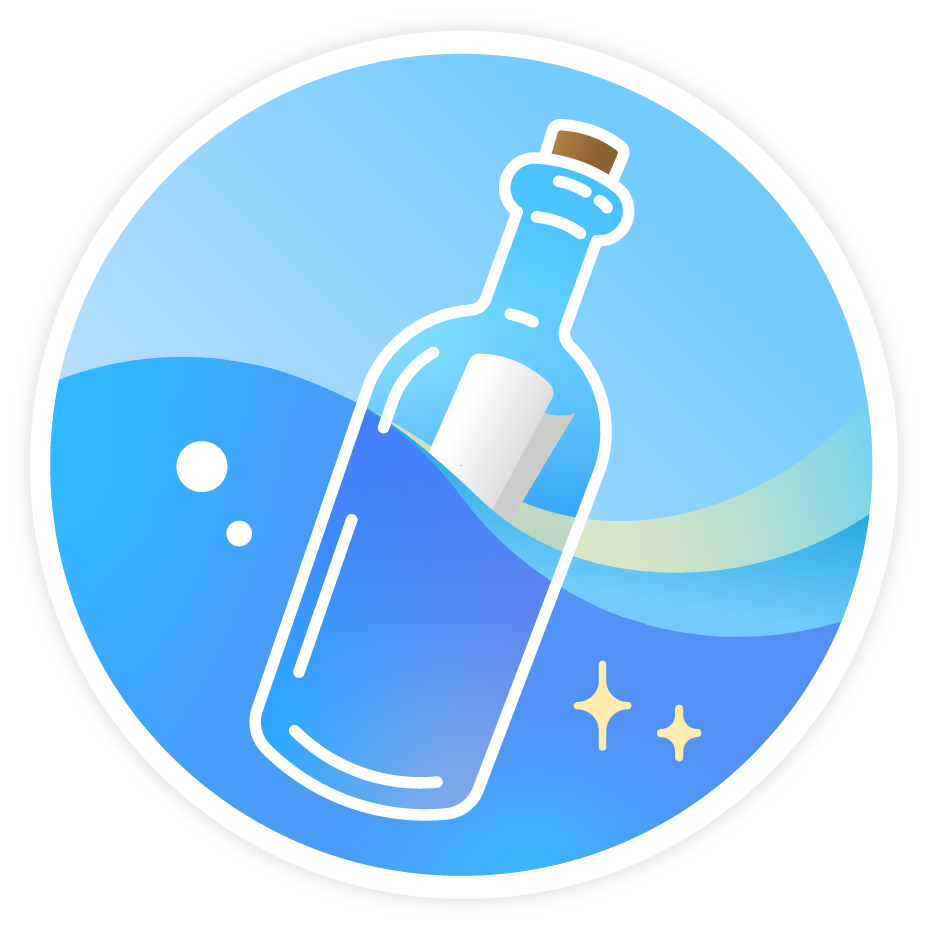
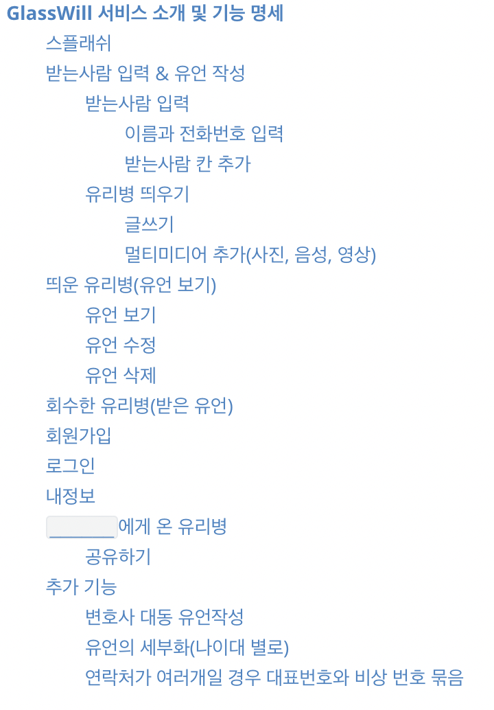
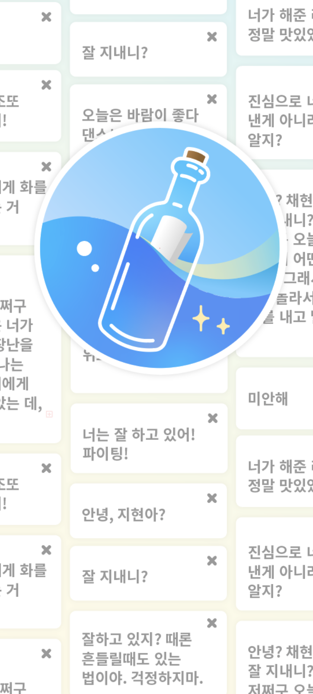
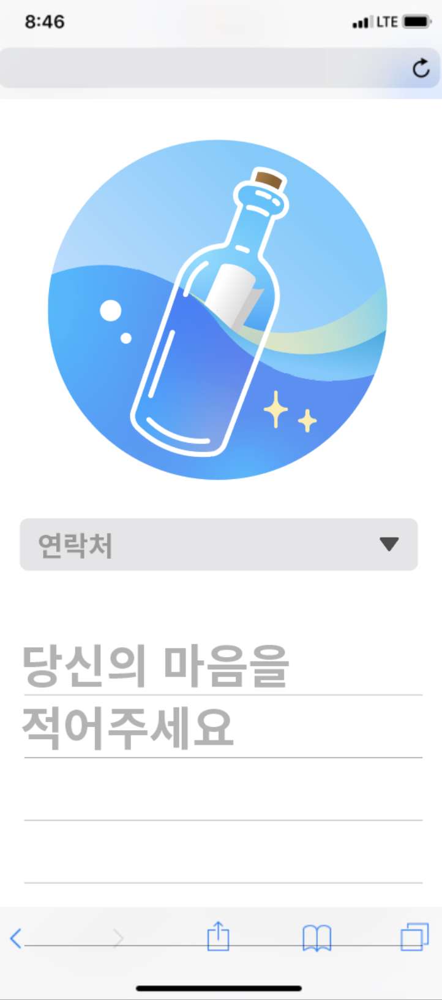
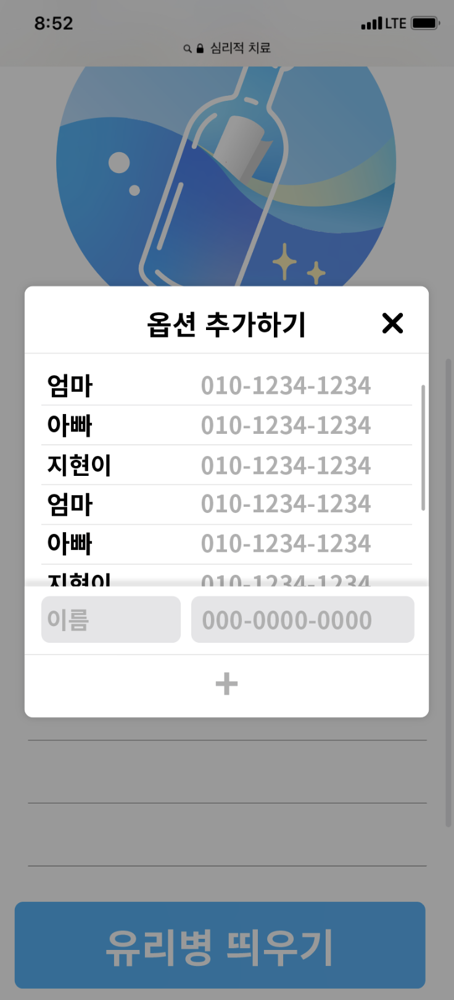

<h1 align="center">GlassWill 유리병 편지</h1>

 

	
	
	

여러분은 언제 죽음을 생각하시나요? 그리고 얼마나 준비하고 계신가요?

`가는데는 순서 없다` 라는 말처럼 누구든 어느날 갑자기 죽음을 맞이 할 수 있습니다.

하지만, 유언을 작성하는 법을 아시나요?, 안다고 해도 직접 쓰는 것은 

GlassWill은 '유언은 어려운 것이다'라는 기존의 유언문화에서 벗어나 누구든 쉽고 간단하게 작성 하는 유언 서비스 입니다.

유언을 쉽고 빠르게 작성해보며 완성해 보세요. 

어쩌면 오늘이 당신의 인생을 되돌아 보고 동기부여를 할 수 있는 역사적인 하루가 될 지도 모르죠.

* 팀 이름: 무소식이 희소식

* 서비스 요약: 1분안에 간단하게 쓰는 디지털 유언

* 도전 챌린지: AngelHackChallange, AWS Challange

* 왜 이 서비스?
  * 젊은 사람들은 죽음을 미리 준비하지 않는다.
  * 하지만 화산, 지진, 인재로 갑자기 내가 죽는다면?
  * 살아서 미리 만드는 남아있는 사람을 위한 글

* 서비스 기능

  1. 유언을 쉽게 작성하도록 해줌

  2. 일정 주기마다 유언을 카톡 플친, 메일등으로 보내줌(`아직 살아있다!`표시 하지않으면 내가 설정한 사람들에게 연락이 감)

* 서비스 니즈 & 타겟

  * 생명의 위협을 느껴 본 사람
  * 생명을 담보로 일하는 사람(스턴트맨)
  * 중환자실에 있는 사람
  * 병원 대기실에 있는 사람

## 스플래쉬

* glasswill.com 으로 접속하면 3초간 스플래시 이미지가 활성화되고 다음화면으로 넘어간다.

* 뒤에 있는 Messages로 유언을 작성하는 가벼운 샘플을 볼 수 있게 한다.

## 받는사람 입력 & 유언 작성

* 연락처를 추가하여 유리병을 바로 띄울 수 있는 페이지

* 해당 정보를 기반으로 문자메시지에 유리병 링크를 보냅니다. 

### 받는사람 입력

#### 이름과 전화번호 입력

* 왼쪽 칸에는 이름 or 별명을 입력하고, 오른쪽 칸에는 전화번호를 입력한다.

#### 받는사람 칸 추가

* 동적으로 리스트를 추가 할 수있는 `+ 버튼` 이 있다.

### 유리병 띄우기

#### 글쓰기

* 유언으로 작성할 텍스트를 기입한다.
* 쉽고 빠르게 작성 할 수 있게 하는 것이 목표
* 처음에는 3줄이지만, 개행할수록 계속 칸이 늘어난다.
  * 내려갈수록 `홍길동에게` 블록은 Navbar에 고정되고 Logo는 위로 쓸려올라간다.

#### 멀티미디어 추가(사진, 음성, 영상)

* 신체가 부자유한 사용자를 고려하여 음성 녹음을 제공
* 사진과 영상을 통해 아날로그로는 할 수 없는 컨텐츠를 제공

## 띄운 유리병(유언 보기)

내가 보내는 유언들의 목록 컨트롤 센터

### 유언 보기

* 내가 보낸 유언들을 볼 수 있는 창
* 인쇄 기능을 제공해야 한다.

### 유언 수정

* 내가 보낸 유언들을 수정 할 수 있는 창

### 유언 삭제

* 내가 보낸 유언들을 삭제 할 수 있는 창

## 회수한 유리병(받은 유언)

누군가 보낸 유언을 단순히 유리병 자체로 보는것은 본인의 과실(문자 삭제로 인한 링크 분실, ··· )로 없어지는 것을 방지하기 위하여 `GlassWill 회원` 에게 `유언 보관함` 제공하는 목적의 페이지

## 회원가입

GlassWill에 가입하여 `회수한 유리병` 을 이용하거나, 직접 유리병을 남길 수 있다.

* 필요한 인적사항
  * Avatar
  * 이름
  * 나이
  * 성별
  * 연락처
  * 이메일
  * 비밀번호
  * 비밀번호 확인
  * 유언보낼 사람들의 연락처
  * ··· 

## 로그인

GlassWill의 회원 로그인을 통해 아이디와 비밀번호를 입력하여 서비스르를 이용한다.

## 내정보

회원 가입때 작성한 정보를 확인하거나 수정 할 수 있다.

## `______`에게 온 유리병

실제 유언 페이지. 대상자는 해당 문서를 문자메시지로 온 `GlassWill 링크` 로 접속 할 수 있다.

### 공유하기

* 유언장을 보고있노라면, 15초정도 뒤에 모달창이 팝업된다.
  * GlassWill 유저라면, 본인 계정에 유리병으로 추가할 수 있다.
  * KakaoTalk 공유, Link 복사, FaceBook 공유 등의 기능을 제공

## 추가 기능

### 변호사 대동 유언작성

법적 효력을 가지는 유언을 작성하고자 하는 유저를 대상으로 제공하는 BM

### 유언의 세부화(나이대 별로)

예를들어, 40대의 아버지가 5살 아들에게 유언을 남긴다고 했을때 

"아들아, 인생은 쉽지않고 세상에 공짜는 없단다."

라고 얘기하는건 나이대에 맞지않는 유언이므로 40대 아버지는 10대의 아들에게 또는 20대, 30대의 아들에게 따로 하고싶은말을 작성 할 수 있도록 한다.

### 연락처가 여러개일 경우 대표번호와 비상 번호 묶음

해외에 나가는 유저나 번호가 여러개인 유저를 관리 할 수 있도록 해야한다.
